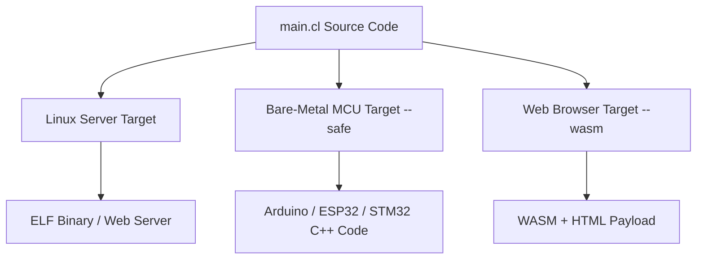

# Cluster-lang: Chapter 12 — Machine Adaptability

This chapter explores Cluster-lang's unique **Machine Adaptability**—the ability of a single source file to target and run across completely different computing environments, from bare-metal microcontrollers to web browsers and enterprise Linux servers.

---

## 1. Defining Machine Adaptability

Most languages are restricted to a specific runtime environment:
*   **Javascript** is optimized for browsers and Node.js servers, but cannot run on bare-metal microcontrollers.
*   **Python** runs on server environments, but is too heavy and slow for low-power chips.
*   **C++** runs anywhere, but requires entirely different codebase layouts, libraries, and compiler toolchains when moving from a Linux server to a microcontroller.

Cluster-lang solves this by decoupling the language syntax from the target runtime. The same Cluster-lang codebase compiles into different C++ structures depending on the compiler flags passed.

---

## 2. Compilation Targets



### A. Enterprise Server Target
By default, the compiler outputs full C++20 code utilizing multi-threaded thread pools, raw Linux sockets, and standard database interfaces.
*   **Command:** `python3 run.py build main.cl`
*   **Outputs:** Optimized ELF binary.

### B. Bare-Metal Microcontroller Target (`--safe`)
When compiling with the `--safe` flag, the compiler isolates the code from the OS.
*   **Command:** `python3 run.py build main.cl --safe`
*   **Features:**
    *   Excludes standard OS headers (sockets, thread pools, file systems).
    *   Generates a single, lightweight C++ file (`main.cpp`) and helper header (`cluster_core.hpp`).
    *   Enables hardware-level built-ins like `pin_mode(pin, mode)`, `digital_write(pin, value)`, and `attach_interrupt(pin, handler, mode)`.
    *   Can be flashed directly onto ESP32, STM32, Arduino, or ARM Cortex chips.

### C. Web Browser Target (`--wasm`)
By passing the `--wasm` flag, the compiler leverages Emscripten toolchains to output browser-ready code.
*   **Command:** `python3 run.py build main.cl --wasm`
*   **Outputs:** HTML, JS, and WebAssembly (`.wasm`) files that run directly inside the browser's sandbox.

---

## 3. Unified Syntax for Diverse Hardware

This adaptability allows writing IoT and server systems in a single language. 

For instance, you can define a data payload schema in a shared file:
```python
// shared.cl
model SensorData:
    id: int
    value: float
```

And compile it for:
1.  **The Sensor Chip (Microcontroller):** Reading physical pins and sending values via serial interface in `--safe` mode.
2.  **The Edge Gateway (Raspberry Pi/Linux):** Aggregating inputs and serving a dashboard using `serve_web`.
3.  **The Client Console (Browser):** Running interactive data visualizations via WebAssembly.
