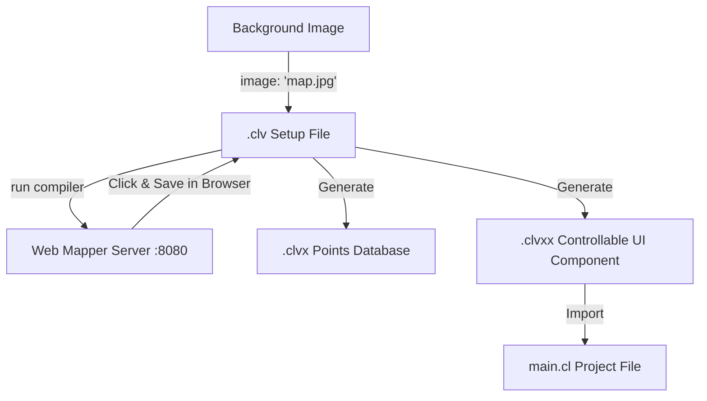

# Chapter 13: Vector Space Mapping & Controllable UI Components (.clv, .clvx, .clvxx)

Cluster-lang provides a revolutionary browser-first workflow for visual coordinate mapping and controllable vector-embedded image rendering. This system is heavily utilized in video editing, VFX, interactive map graphics, and UI design where pixel coordinates must translate seamlessly into controllable programming variables.

---

## 1. The Core Architecture: .clv, .clvx, and .clvxx

The mapping pipeline is split into three unified files:
1. **`.clv` (Vector Setup File):** The developer-provided definition file specifying the target background image path and subsequent saved control coordinates.
2. **`.clvx` (Vector Coordinate Database):** A text database generated by the compiler containing raw coordinates and their names.
3. **`.clvxx` (Vector UI Component):** The transpiled HTML/SVG component containing the image overlay, neon points, popup boxes, and programmatic zoom triggers.



---

## 2. Interactive Coordinate Mapping (Browser-First)

Unlike traditional tools that require coordinates to be manually coded, Cluster-lang lets developers map points visually:

### Step 1: Create the `.clv` file
Create a file named `world_map.clv` with only the background image declared:
```text
image: "world_map.jpg"
```

### Step 2: Run the compiler
Run the `.clv` file using the Cluster compiler:
```bash
cluster world_map.clv
```
This automatically starts a local HTTP server on `http://localhost:8080` and opens your default browser.

### Step 3: Map points in the browser
1. As you move the mouse on the image, a neon crosshair tracks your cursor and displays the exact natural pixel coordinate.
2. Click on any region (e.g. India).
3. The browser will prompt you: *"Do you want to save coordinate [697, 516]?"*.
4. Input the name (e.g. `India`).
5. The server automatically appends `point: 697.0, 516.0, "India"` directly to your `world_map.clv` file on disk, regenerates the files inside `cl-vector/`, and refreshes the browser page to display the new marker!

---

## 3. The Generated Output Files

### The Points List Database (`cl-vector/world_map.clvx`)
This is a standard text database of points:
```text
point: 697.0, 516.0, "India"
point: 547.0, 564.0, "Africa"
```

### The Controllable UI Component (`cl-vector/world_map.clvxx`)
This is a transpiled Cluster UI component that displays the interactive map. The component accepts a parameter `active_label` (defaulting to `""`) to programmatically focus and zoom-in on a point on load:
```html
<component name="World_mapMap" active_label: string = "">
    <!-- SVG and HTML overlay template -->
</component>
```

---

## 4. Programmatic Control in Cluster-lang

Once the `.clvxx` file is generated, you can import and render it inside any `.cl` application:

```python
import "cl-vector/world_map.clvxx" as visual

fn main():
    // Render the controllable map focusing on India
    html := visual.World_mapMap("India")
    serve_web(8080, html)
```

The component also automatically reads URL query parameters (`?q=India`), allowing you to build dynamic searches where the map zooms to matching locations on query submission:

```python
import "cl-vector/world_map.clvxx" as visual

fn main():
    // Serve search bar + controllable map component
    html := str("<html><body><form>")
    html = html + str("<input name='q' placeholder='Search location...'>")
    html = html + str("</form>") + visual.World_mapMap("") + str("</body></html>")
    serve_web(8080, html)
```
When a user searches for `"India"`, the URL changes to `?q=India`, and the SVG overlay automatically triggers a smooth CSS translation zoom-in directly on the coordinate node mapped to India!

---

## 4. Customizing the Point Marker UI

Developer coders can easily customize the visual styling of coordinate point markers (e.g. outline circle, inner dot, text labeling) using two different options:

### Option A: Edit the Generated `.clvxx` File Directly
The generated `cl-vector/world_map.clvxx` contains raw HTML/SVG vector nodes. You can customize visual attributes (like `fill`, `stroke`, `stroke-width`, or circle radius `r`) directly in the file:
```html
<circle cx="697.0" cy="516.0" r="10" fill="#ff0055" stroke="#00ffcc" stroke-width="3"></circle>
```

### Option B: Customize Globally via CSS in `css.clx`
Because the SVG circles are standard DOM elements, you can style them globally in your project's stylesheet (`css.clx`):
```css
/* Change all marker circle styles globally */
circle {
    fill: #00ffcc !important;    /* Inner dot color */
    stroke: #ff007f !important;  /* Outer outline color */
    stroke-width: 3px !important;
}
/* Style point text labels globally */
text {
    fill: #ffffff !important;
    font-size: 11px !important;
    text-shadow: 2px 2px 4px #000;
}
```

---

## 5. Cluster-lang as a High-Speed Site Generator (Astro & Jekyll Equivalent)

Cluster-lang is equipped to serve as an ultra-fast hybrid Static Site Generator (SSG) and Server-Side Rendering (SSR) platform (similar to Astro, Jekyll, or Hugo). 

### How the Hybrid Site Generation Architecture Works:
1. **Frontend Assets:** You design the layout, styling, and interactivity using clean HTML, CSS, and JS.
2. **Modular Templates (`.cltp`):** You define reusable layout structures inside templates (with `.cltp` file extension, as `.clt` is reserved for database table schemas).
3. **Data & Article Contents (`.cld`):** Content and metadata for pages and articles are stored inside `.cld` files (Markdown/JSON content sources).
4. **Native C++ Compilation (`.out`):** The Cluster compiler reads the source files, parses the data, compiles templates, and outputs a single high-performance native `.out` binary. 
5. **Raw Execution Speed:** At runtime, the `.out` binary executes on the server at extreme machine speeds, serving pages instantly with zero runtime interpretation overhead (no Node.js, Ruby, or Python interpreter lag).

---

## 6. SEO Optimization & Search Engine Mastery

A common concern in modern web development is whether search engines (like Googlebot) can index pages properly. 

> [!IMPORTANT]
> **SEO Optimization works perfectly in Cluster-lang—and is far superior to modern JavaScript single-page frameworks (like React, Vue, or Angular).**

### Why Cluster-lang is an SEO Powerhouse:
* **Zero Client-Side JavaScript Hydration Delay:** Single Page Applications (SPAs) send an empty HTML page to the browser and build the DOM using client-side JavaScript. If search engine crawlers do not wait for the JavaScript to execute, they index a blank page. Cluster-lang performs **High-Speed Server-Side Rendering (SSR)**. The crawler receives a fully completed, rich semantic HTML document on the very first byte.
* **Instant Core Web Vitals:** Google heavily ranks pages based on page load speed (Largest Contentful Paint, First Contentful Paint). Because Cluster-lang compiles to native C++ binaries, it renders pages in microseconds. This guarantees near-instantaneous page delivery, leading to perfect Core Web Vitals scores and superior search rankings.
* **Semantic HTML Injection:** Title tags, meta descriptions, and header Hierarchies (`<h1>`-`<h6>`) are embedded directly in the server response, ensuring search crawlers read metadata immediately without waiting.
