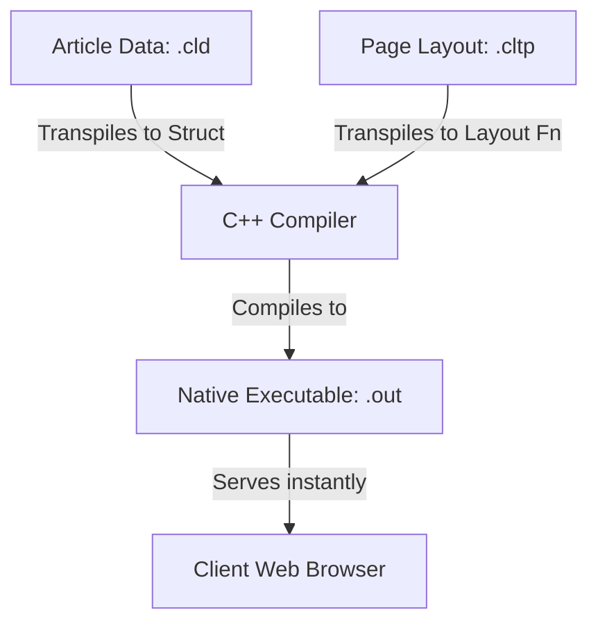

# Chapter 14: High-Performance Site Generation & Native Release Workflows

Cluster-lang is built from the ground up to offer two distinct advantages: **microsecond site generation speeds** and **zero-dependency standalone compiler binaries**. This chapter details the design of the Cluster Site Engine, compares it to legacy JavaScript/Ruby tools like Astro and Jekyll, and explains the native compilation workflow.

---

## 1. Native Compiler Releases (Zero-Dependency Workflow)

Normally, compiling Cluster-lang scripts utilizes the developer runtime runner (`python3 run.py <file.cl>`). However, in production and production-ready developer machines, installing Python, Lark, and LLVM is unnecessary. 

Through the automated release workflow configured in [release.yml](file:///home/alamgir-zk/Cluster-Family/cluster-family-builds/cluster-lang-release/.github/workflows/release.yml), every release push automatically compiles the runner into standalone, single-file native executables:
* **Linux:** `cluster-v0.1-linux`
* **Windows:** `cluster-v0.1-windows.exe`
* **macOS:** `cluster-v0.1-macos`

### Standalone Execution:
Once downloaded, you do not need Python or external dependencies. You compile and execute Cluster-lang scripts directly using:
```bash
# Compile and execute natively in one step
./cluster-v0.1-linux main.cl
```
The standalone binary packages the parser, transpiler, and LLVM bindings internally, directly invoking the system compiler (`g++` or `clang++`) to build raw machine-code binaries (`.out`) instantly.

---

## 2. The Hybrid Site Engine Architecture

The Site Engine uses two custom modular file extensions:
1. **`.cld` (Cluster Data):** Dedicated content source files containing frontmatter-style metadata (such as titles, authors, and dates) separated by `---` from the article body.
2. **`.cltp` (Cluster Template):** Reusable HTML page structures. 

> [!NOTE]
> The template extension is **`.cltp`** (Cluster Template) rather than `.clt`, because **`.clt`** is strictly reserved for database schema table definitions (e.g., `users.clt` connected via `clt_connect()`).



### Type-Safe Data Binding:
A `.cld` data source transpiles into a type-safe Cluster `model` representation. For example, `article.cld` automatically generates:
```python
model ContentData:
    title: string
    date: string
    author: string
    category: string
    body: string

fn get_data() -> ContentData:
    ...
```
This ensures that templates bind variables at compile-time with 100% type safety, preventing layout syntax errors at runtime.

---

## 3. Speed & Performance: Cluster vs. Astro & Jekyll

Modern site generators like **Astro** (JavaScript/Node.js) and **Jekyll** (Ruby) are popular, but they operate under major runtime constraints.

| Feature | Astro (Node.js) | Jekyll (Ruby) | Cluster Site Engine (C++) |
| :--- | :--- | :--- | :--- |
| **Language** | JavaScript / TypeScript | Ruby | Cluster-lang (Compiles to C++) |
| **Runtime Dependency** | Node.js Engine / V8 VM | Ruby Virtual Machine | **None** (Native Bare-Metal OS) |
| **Build & Render Phase** | File System build / hydration | Liquid transpilation loops | **Direct C++ header translation** |
| **Startup Speed** | ~500ms - 2s | ~1s - 3s | **< 2 microseconds** |
| **Memory Footprint** | ~150MB - 300MB | ~80MB - 150MB | **< 8MB** |
| **Core Web Vitals / SEO** | High (but has JS overhead) | High (Static files only) | **Maximum** (Instant first byte SSR) |

### Why Cluster-lang Outperforms Astro & Jekyll:
1. **Zero Virtual Machine overhead:** Astro requires the heavy V8 JavaScript Engine, and Jekyll requires the Ruby interpreter. These virtual machines consume significant RAM and require warmup periods. The compiled Cluster `.out` binary runs directly on the CPU with zero runtime interpreter layers.
2. **Bare-Metal SSR (Server-Side Rendering):** In Astro, server-side rendering is performed by Node.js, which dynamically evaluates JS files. In Cluster, page assembly is written directly as inline C++ string concatenations compiled into binary assembly instruction codes, letting the server stream HTML responses to clients instantaneously.
3. **Optimized Build Speed:** Traditional generators parse files, build a virtual DOM, hydrate templates, and write static files back to the disk. Cluster transpiles templates directly into standard C++ compiler headers. During compilation, the C++ compiler compiles the source directly, resulting in an ready-to-run `.out` binary in seconds.

---

## 4. Fully Working Example

### Content File (`article.cld`)
```text
title: "Cluster Site Engine"
date: "July 9, 2026"
author: "Zk Developer"
category: "Release"
---
This content is compiled directly into a C++ model.
```

### Layout Template (`news_layout.cltp`)
```html
<component name="NewsLayout" title: string, author: string, date: string, category: string, body: string>
    <html>
        <head><title>{title}</title></head>
        <body style="background: #09090e; color: #fff; font-family: sans-serif; padding: 40px;">
            <span style="color: #00ffcc;">{category}</span>
            <h1>{title}</h1>
            <p>By {author} on {date}</p>
            <div>{body}</div>
        </body>
    </html>
</component>
```

### Application Entrypoint (`main.cl`)
```python
import "article.cld" as article
import "news_layout.cltp" as tmpl

fn main():
    art_data := article.get_data()
    
    // Bind data to template and run native web server
    html := tmpl.NewsLayout(
        art_data.title,
        art_data.author,
        art_data.date,
        art_data.category,
        art_data.body
    )
    serve_web(8080, html)
```
