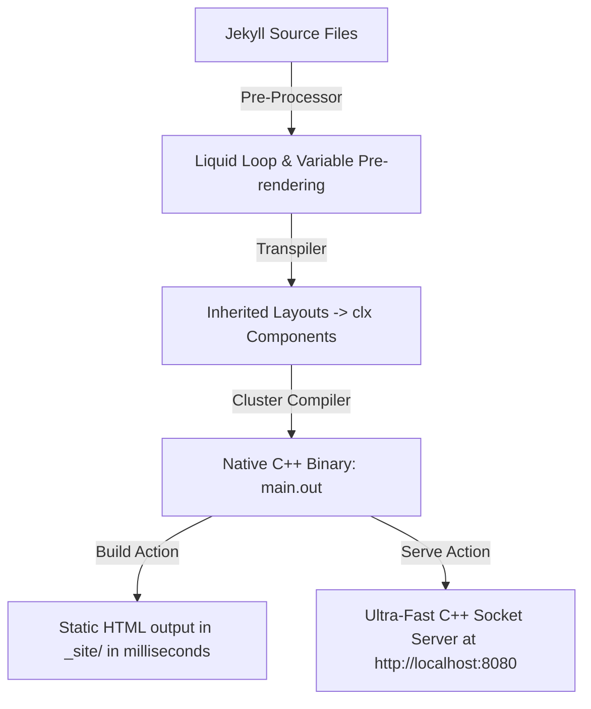

# Chapter 16: The Cluster-Jekyll Hybrid Compiler Bridge

While static site generators like Jekyll are fast and reliable, their dependency on heavy Ruby VMs and slow rendering engines makes them less suitable for large-scale, real-time backend execution. Cluster-lang bridges this gap with its native **Cluster-Jekyll Compiler Bridge** — enabling developers to build standard Jekyll projects directly into optimized C++ binaries without needing Ruby installed.

---

## 1. Architecture Overview

The compiler bridge translates the standard Jekyll directory structure (`_layouts`, `_posts`, `_includes`, and `_config.yml`) into native Cluster components (`.clx`) and pre-renders Liquid loop blocks into raw static pages.



### Key Differences:
* **No Ruby VM:** Bypasses slow Ruby VM start-up times entirely.
* **Pre-rendered Loops:** Liquid loops (``) and dot-path properties (`{{ site.author.name }}`) are pre-rendered into standard HTML during parsing.
* **Layout Components:** Standard HTML layouts are compiled into native `.clx` layout components.

---

## 2. Using the CLI Commands

To build or serve your Jekyll project, use the native `cluster` CLI commands.

### A. Building the Static Site
To compile the project and generate the static site files inside the `_site/` directory, run:
```bash
cluster --jekyll build
```
The compiler parses all layouts, processes the posts, wraps the content, and outputs clean static files in milliseconds.

### B. Launching the Local Serve Server
To spin up a high-performance, non-blocking C++ server to test your site locally:
```bash
cluster --jekyll serve
```
This launches a native web server on `http://localhost:8080` with response times under **1.5 milliseconds**, bypassing slow file-watchers and node blockers.

---

## 3. High-Performance Socket Routing

The Cluster server uses a non-blocking TCP socket implementation inside the standard library (`serve_web`) optimized specifically for Jekyll-like assets.

### Features of the C++ Server:
1. **Zero-Delay Connections:** Closes connections gracefully immediately after header consumption and response streaming, avoiding socket-blocking `recv` bottlenecks.
2. **Directory & Index Mapping:** Automatically maps paths (e.g. `/blog/news`) to their respective index files (`_site/blog/news/index.html`).
3. **Asset Mime-Type Auto-detection:** Instantly reads and returns correct headers for `.css`, `.js`, `.png`, `.jpg`, `.svg`, and `.json` assets.

```python
// Conceptual representation of the compiled server loop
fn start_jekyll_server():
    put "[Cluster-Jekyll] Serving at http://localhost:8080"
    // Starts server using optimized stdlib routing pointing to _site/
    serve_web(8080, home_html)
```

---

## 4. Bypassing Jekyll Weaknesses

Standard Jekyll suffers from a lack of dynamic server-side capabilities. With Cluster-Jekyll, you can easily transition from a static site to a dynamic server:
* **Server-Side Rendering (SSR):** Inject database queries (`table` and `sqlite` operations) directly into your layouts.
* **Dynamic APIs:** Run `serve_api` alongside the static server on the same binary to serve JSON API responses.
* **Native AI Integrations:** Execute dynamic LLM content hydration at runtime using `ai_ask`.
